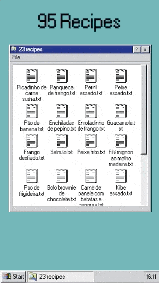

# 95Recipes

This project was made by me to simplify my life when I'm cooking.
I have a restricted diet and for most of the dishes, I need to write its recipe.

To help me with this, I needed to write my dishes in a place where it would be
easy to read/write and maybe to share with someone with the same restrictions.
So, I ended up with Google Sheets. Why not?

My DB is this sheet: https://docs.google.com/spreadsheets/u/1/d/1Uou8R5Bgrdl9M8ykKZeSj5MAl_huugiG3rRIQyMtxvI/edit?usp=sharing

As I need a solution to help me when I'm cooking, I put some effort to build it
to work offline, shareable and installable. PWA to the rescue!
